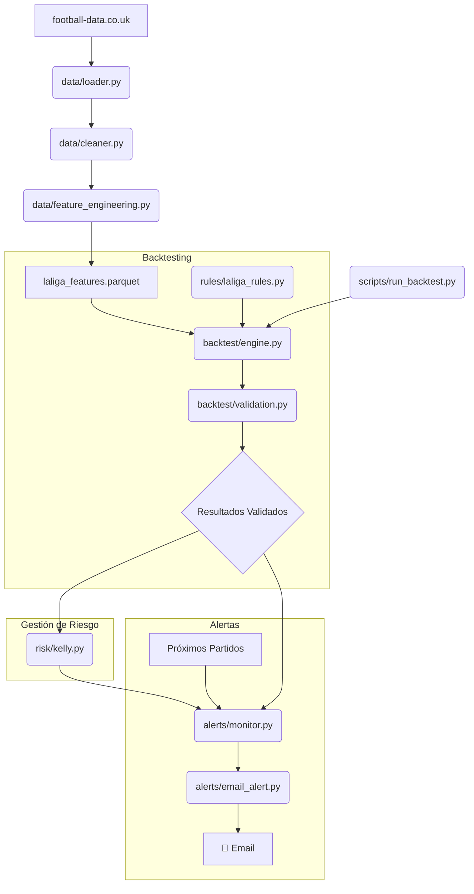

# 🏛️ Arquitectura del Sistema

Este documento describe la arquitectura y las decisiones de diseño detrás del **Sistema de Alertas de Apuestas Deportivas**.

---

## 🎯 Principios de Diseño

La arquitectura se basa en los siguientes principios clave:

1.  **Modularidad y Separación de Concerns:** Cada componente tiene una única responsabilidad, lo que facilita el mantenimiento, la depuración y la extensibilidad. Los módulos de `data`, `rules`, `backtest`, `risk` y `alerts` están completamente desacoplados.

2.  **Robustez y Validación:** La prioridad no es encontrar muchas reglas, sino encontrar reglas **estadísticamente significativas** y **robustas**. Se implementan múltiples capas de validación (train/test split, test binomial, detección de overfitting) para evitar falsos positivos.

3.  **Eficiencia:** El uso del formato **Parquet** para el almacenamiento de datos intermedios acelera drásticamente las operaciones de I/O en comparación con CSV, lo que es crucial para un backtesting rápido y eficiente.

4.  **Configuración Centralizada:** Todos los parámetros del sistema (rutas, umbrales, ventanas de features, etc.) se gestionan en un único archivo (`src/config.py`), permitiendo ajustes rápidos sin modificar el código fuente.

5.  **Prevención de Data Leakage:** La generación de features cronológicas se implementa de manera estricta para evitar el **look-ahead bias**, asegurando que el backtest simule condiciones reales donde solo se dispone de información pasada.

---

## 🧩 Diagrama de Componentes

---

## 📦 Descripción de Módulos

### `src/data/`
-   **Responsabilidad:** Descarga, limpieza, transformación y generación de features.
-   **`loader.py`:** Descarga los CSV desde `football-data.co.uk` y gestiona la carga/guardado de dataframes en formato Parquet.
-   **`cleaner.py`:** Estandariza los nombres de las columnas, convierte los tipos de datos y añade metadatos básicos (BTTS, Total Goles, etc.).
-   **`feature_engineering.py`:** La parte más crítica. Calcula features cronológicas como la forma, rachas y promedios de goles, iterando sobre el dataset para evitar el data leakage.

### `src/rules/`
-   **Responsabilidad:** Definir la lógica de las estrategias de apuesta.
-   **`base.py`:** Contiene la clase `Regla`, una estructura de datos que define la interfaz para todas las reglas (nombre, condición, tipo de apuesta, etc.).
-   **`laliga_rules.py`:** Un factory (`crear_reglas_laliga`) que instancia y configura todas las reglas específicas para La Liga. Aquí es donde se define la "magia" del sistema.

### `src/backtest/`
-   **Responsabilidad:** Ejecutar las reglas contra los datos históricos y validar los resultados.
-   **`engine.py`:** El motor principal que itera sobre cada partido del dataset y evalúa cada regla activa. Calcula métricas básicas de rendimiento (ROI, Win Rate).
-   **`metrics.py`:** Funciones para calcular métricas avanzadas como Sharpe Ratio y Max Drawdown.
-   **`validation.py`:** Componente clave para la robustez. Realiza el split temporal, ejecuta el **test binomial** para confirmar la significancia estadística y compara los resultados de train vs. test para **detectar overfitting**.

### `src/risk/`
-   **Responsabilidad:** Gestionar el tamaño de las apuestas.
-   **`kelly.py`:** Implementa el **criterio de Kelly fraccionado**. Calcula el stake óptimo basado en la confianza de la regla (probabilidad estimada) y la cuota, asegurando un crecimiento del bankroll a largo plazo y minimizando el riesgo de ruina.

### `src/alerts/`
-   **Responsabilidad:** Notificar sobre futuras oportunidades.
-   **`email_alert.py`:** Formatea y envía un email detallado cuando una regla validada se dispara para un próximo partido.
-   **`monitor.py`:** (Futuro) Un script que se ejecuta periódicamente, carga los próximos partidos, los evalúa contra las reglas y dispara las alertas.

### `scripts/`
-   **Responsabilidad:** Puntos de entrada para ejecutar las tareas principales del sistema.
-   **`run_backtest.py`:** El script principal que orquesta todo el pipeline: carga de datos, generación de features, backtesting y validación.
-   **`update_data.py`:** Script para forzar la descarga de los datos más recientes.

---

## 🛠️ Decisiones Clave y Justificación

-   **¿Por qué Parquet en lugar de CSV?**
    -   **Rendimiento:** Parquet es un formato columnar que permite una compresión y codificación más eficientes. Las lecturas son significativamente más rápidas porque solo se cargan las columnas necesarias. Para un dataset de ~3000 partidos, la diferencia es notable.
    -   **Tipos de Datos:** Almacena el esquema y los tipos de datos, evitando errores de parsing que son comunes con CSV.

-   **¿Por qué Test Binomial?**
    -   Es la prueba estadística correcta para determinar si una serie de aciertos y fallos (ensayos de Bernoulli) es significativamente mejor que el azar (p=0.5). Un p-value bajo (<0.05) nos da confianza en que la ventaja de la regla es real.

-   **¿Por qué Kelly Fraccionado?**
    -   El criterio de Kelly completo es conocido por ser demasiado agresivo y puede llevar a una alta volatilidad. Usar una fracción (ej. 25%) permite capturar la mayor parte del crecimiento a largo plazo mientras se reduce drásticamente el riesgo y el drawdown.

-   **¿Por qué no Machine Learning?**
    -   El objetivo era crear un sistema **auditable y explicable** ("white box"). Con reglas simples, podemos entender exactamente por qué se realiza una apuesta. Los modelos de ML, aunque potencialmente más potentes, a menudo actúan como "cajas negras", dificultando la depuración y la confianza en sus decisiones.

